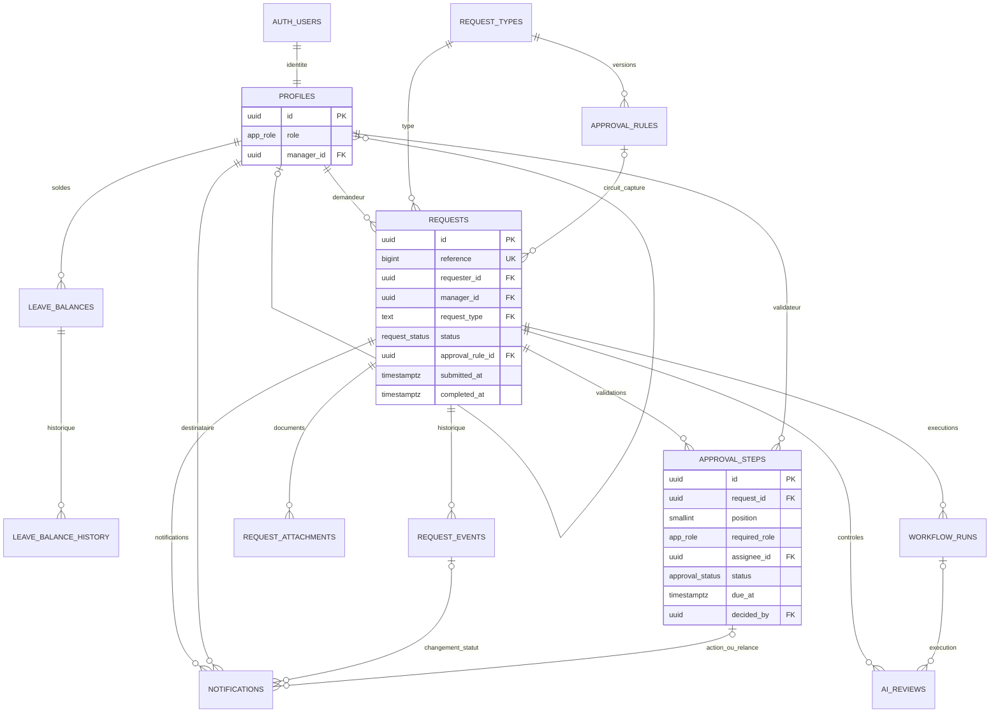
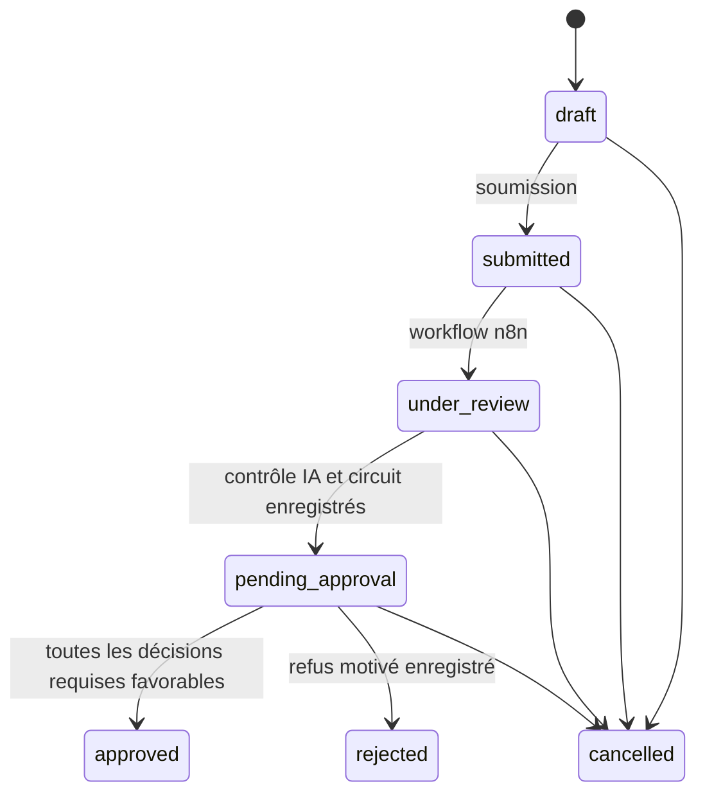

# Schéma de données NovaCorp

Cette base couvre le socle de la plateforme RH décrit dans le **Fil Rouge - Automatisation - Plateforme RH.pdf**, pages 1 à 3 : quatre types de demandes, routage manager → RH → DRH selon les seuils, contrôle IA, décisions tracées, notifications, supervision et mesure des délais. Les workflows n8n et les écrans seront développés séparément.

Le PDF ne donne ni la liste détaillée des champs de formulaire, ni les seuils chiffrés, ni les délais de décision et de relance. Les champs ci-dessous sont des choix de modélisation ; les valeurs métier restent à définir. Les pièces jointes sont possibles, sans être obligatoires. Leur analyse par l'IA, présentée comme un bonus dans le document, n'est pas implémentée.

## Tables et relations



`process_measurements` contient des observations agrégées avant/après ; elle n'est pas rattachée à une demande individuelle.

| Table | Contenu |
|---|---|
| `profiles` | Identité métier reliée à Auth, rôle et manager. Pas de mot de passe ni de duplication d'email. |
| `request_types` | Congés (`leave`), télétravail (`remote_work`), matériel (`equipment`), formation (`training`). |
| `approval_rules` | Circuit versionné par type, seuils DRH, délai de décision et intervalle de relance. |
| `requests` | Demande, champs typés, manager et règle capturés lors de la soumission, horodatages. |
| `approval_steps` | Manager, RH puis DRH si nécessaire ; affectation, échéance, décision et commentaire. |
| `request_events` | Créations, modifications de brouillon, changements de statut et décisions. |
| `leave_balances` | Droits annuels, jours consommés et réservés, disponible calculé. |
| `leave_balance_history` | Valeurs avant/après des soldes, auteur et date. |
| `request_attachments` | Métadonnées des fichiers ; contenu dans le bucket privé `hr-attachments`. |
| `workflow_runs` | Workflow n8n, identifiant d'exécution, tentative, durée et erreur. |
| `ai_reviews` | Contrôles structurés, qualification, synthèse, brouillon de réponse, modèle, tokens et coût. |
| `notifications` | File d'envoi email/Slack, destinataire, tentatives, reprise, état d'envoi et clé de déduplication. |
| `process_measurements` | Mesures fictives ou observées : période, échantillon, méthode, délai moyen et coût manuel. |

Les index couvrent le demandeur, le manager, les états, les validateurs, les échéances, les historiques et la file de notifications.

## Champs des quatre demandes

Tous les types ont un titre, une description facultative et un demandeur. Un brouillon peut être incomplet.

| Type | Champs requis à la soumission | Champs spécifiques |
|---|---|---|
| Congés | Dates de début/fin, nombre de jours demandé | `requested_days`, décimal pour les journées partielles |
| Télétravail | Dates de début/fin | Période |
| Matériel | Montant estimé total, quantité | Le titre désigne le matériel |
| Formation | Dates de début/fin, montant estimé total | Organisme facultatif `training_provider` ; le titre désigne la formation |

Les montants de demandes sont exprimés en EUR ; les coûts LLM peuvent être en EUR ou USD et ne doivent pas être additionnés sans conversion. Les dates inversées, quantités nulles/négatives, montants négatifs et champs appartenant à un autre type sont refusés. Un montant nul (0 EUR) est permis pour une formation ou un matériel gratuit.

Le nombre de jours ouvrés, les jours fériés, la disponibilité du solde par année et la détection de doublons seront vérifiés par le workflow. Une demande couvrant plusieurs années doit être répartie entre les soldes correspondants par ce traitement. Le LLM fournit une synthèse ; il ne dispose pas d'un droit de modifier les rôles, soldes ou décisions. La réservation/consommation des congés devra être atomique et idempotente lors du développement du workflow ; le schéma seul n'effectue pas encore ces mouvements.

## Circuits configurables

Les quatre règles initiales sont **désactivées**, sans valeur de seuil ou de délai inventée.

Avant d'activer un circuit, définir :

- `decision_hours` : délai accordé à chaque validateur ;
- `reminder_hours` : intervalle des relances, positif et inférieur ou égal au délai ;
- `director_amount_above` : seuil de montant déclenchant le DRH ;
- `director_days_above` : seuil de durée de congés déclenchant le DRH.

Manager puis RH sont requis. Le DRH est requis si le montant **dépasse strictement** son seuil **ou** si le nombre de jours **dépasse strictement** son seuil. Un seuil `NULL` signifie que ce critère n'est pas utilisé : décider explicitement des critères pertinents pour chaque type avant activation. Au seuil exact, il n'y a pas d'escalade selon ce critère.

Une seule version est active par type. Après sa première utilisation, ses paramètres sont figés ; elle peut uniquement être désactivée. Pour changer un circuit, désactiver l'ancienne version et insérer une nouvelle version. Les demandes déjà soumises conservent leur règle et leur manager.

Les données de tests comportent des seuils et délais purement fictifs, annulés par `ROLLBACK`. Elles ne configurent pas l'environnement métier.

## États et opérations



Les états terminaux ne sont pas réouverts. La suppression physique n'est pas accessible aux utilisateurs ni au compte n8n. L'annulation par le demandeur est un choix de conception pour les demandes non terminées.

| Opération | Appelant | Effet |
|---|---|---|
| INSERT / UPDATE de `requests` | Demandeur connecté | Créer et modifier ses brouillons, uniquement les colonnes de contenu autorisées. |
| `submit_hr_request(p_request_id)` | Demandeur connecté | Verrouiller le brouillon, vérifier la règle et le manager, figer le contenu et soumettre. |
| `cancel_hr_request(p_request_id)` | Demandeur connecté | Annuler sa demande non terminée. |
| `decide_hr_approval(p_step_id, p_approve, p_comment)` | Validateur affecté connecté | Une décision unique ; commentaire obligatoire en cas de refus. |
| `transition_hr_request(p_request_id, p_status)` | Backend n8n uniquement | Avancer le statut sous contrôle des invariants. |

Exemple côté interface, avec le client Supabase lié à la session :

```ts
await supabase.rpc("submit_hr_request", { p_request_id: requestId });
await supabase.rpc("decide_hr_approval", {
  p_step_id: stepId,
  p_approve: false,
  p_comment: "Motif du refus",
});
```

Les RPC vérifient l'identité côté base. Le backend est privilégié, mais les triggers lui imposent également les transitions, le gel des paramètres utilisés, la cohérence des validateurs, les liens entre demandes et l'historisation. Le rôle `service_role` est réservé aux automatisations de confiance ; il ne doit pas être transmis au navigateur ou au LLM.

Les horodatages sont produits par la base, pas par le navigateur. Les décisions verrouillent la demande puis l'étape, pour éviter des décisions concurrentes incompatibles. Une auto-approbation est refusée, y compris si le demandeur a un rôle de validateur.

## Permissions RLS

Les brouillons sont privés : ni le manager ni les RH ne les voient, sauf leurs propres brouillons.

| Données | Salarié | Manager | RH / DRH |
|---|---|---|---|
| Profils | Son profil | Son profil et son équipe | Ensemble des profils |
| Demandes, étapes, historique, fichiers | Ses demandes | Ses demandes et demandes soumises dont il est manager/validateur | Leurs brouillons et toutes les demandes soumises |
| Soldes et historique des soldes | Son solde | Son solde et ceux de son équipe | Ensemble des soldes |
| Synthèses IA | Aucune comme demandeur | Demandes soumises qu'il valide, hors ses propres demandes | Demandes soumises, hors leurs propres demandes |
| Notifications | Celles qui lui sont destinées | Celles qui lui sont destinées | Ensemble pour supervision |
| Exécutions n8n et mesures agrégées | Aucun accès | Aucun accès | Lecture |

Les profils, règles, soldes, analyses IA, exécutions et notifications n'ont pas de droit d'écriture utilisateur. L'historique est en lecture seule, même pour n8n ; la base y ajoute automatiquement les événements. Le visiteur anonyme n'a accès à aucune table métier ni aux RPC de demande.

`requests`, `approval_steps`, `request_events` et `notifications` sont publiées dans Supabase Realtime. L'interface devra encore s'abonner et actualiser ses données ; la publication seule ne crée pas le dashboard.

## Pièces jointes

Le bucket `hr-attachments` est privé. La limite technique initiale est de **10 Mio** par fichier, modifiable dans une migration ; aucune analyse de pièce jointe n'est ajoutée à cette étape.

1. Générer un UUID de pièce jointe côté client.
2. Téléverser dans `hr-attachments` avec le chemin exact `request_uuid/attachment_uuid`, sans `upsert`.
3. Insérer `request_attachments` avec ces UUID, le même chemin et les métadonnées.
4. Si la création de la fiche échoue, supprimer le fichier encore lié au brouillon ou reprendre l'opération.

Le contenu est téléchargeable uniquement par les lecteurs autorisés de la demande. Les téléversements et suppressions utilisateur sont limités à leurs brouillons. Aucun remplacement silencieux de fichier n'est autorisé. La base refuse une fiche dont le fichier n'existe pas dans Storage. La suppression d'une fiche ne supprime pas physiquement le fichier : l'application devra effectuer les deux opérations et gérer leurs reprises.

## Contrat pour les futurs workflows n8n

1. Détecter une demande `submitted` et passer à `under_review`.
2. Enregistrer une `workflow_runs` avec un identifiant d'exécution unique.
3. Effectuer les contrôles de dates, de solde et de doublons ; enregistrer `ai_reviews` avec qualification et synthèse. En cas d'erreur, conserver l'erreur et relancer le traitement, sans considérer le contrôle comme réussi.
4. Lire la règle capturée et créer les étapes `waiting` : manager affecté, RH choisi, DRH choisi si dépassement.
5. Passer à `pending_approval`, puis activer le manager (`pending`). La base fixe l'échéance et met sa notification en file.
6. À chaque décision utilisateur, activer l'étape suivante après l'accord précédent. Après un refus, terminer en `rejected` ; après tous les accords, terminer en `approved`. Pour les congés, intégrer le mouvement de solde dans une transaction contrôlée avant de finaliser.
7. Traiter les notifications en file, envoyer les emails vers MailHog (`mailhog:1025`) ou Slack, puis enregistrer le résultat d'envoi.
8. Déclencher les relances selon la règle, avec une clé unique par étape/canal/occurrence ; vérifier que la demande et l'étape sont encore actives avant chaque envoi.

Chaque changement de statut crée automatiquement une notification au demandeur. L'activation d'une étape crée une notification au validateur. Les clés de déduplication évitent de créer plusieurs lignes pour le même événement ; n8n devra encore gérer la prise en charge exclusive des jobs et les reprises SMTP. Une clé unique ne garantit pas à elle seule un envoi externe exactement une fois.

Ne pas stocker de clés API, de prompts complets, de réponses brutes non nécessaires ou de données réelles dans les tests. Les champs d'erreur doivent être nettoyés avant enregistrement. La durée de conservation et la procédure de purge des lignes et fichiers restent à définir ; aucune purge automatique n'est activée.

## Application et vérification

Sur une installation déjà démarrée, sans réinitialiser la base :

```powershell
npm run db:migrate
npm run db:types
npm run db:lint
npm run db:test
npm test
```

Les migrations sont additives et conservent les comptes déjà créés. Les quatre types et leurs règles désactivées sont initialisés par les migrations. Aucun solde, demande ou observation réelle n'est inventé.

Les tests pgTAP utilisent une transaction annulée en fin de test, six utilisateurs fictifs et un circuit fictif. Ils vérifient les accès, les contraintes, les RPC et le cycle complet avec DRH. Les tests navigateur existants continuent de vérifier l'authentification.

Les types `src/types/database.ts` sont générés depuis le schéma public et utilisés par les clients Supabase. Les droits d'écriture réels restent ceux de PostgreSQL : les types générés ne constituent pas une autorisation.

Références techniques : [RLS Supabase](https://supabase.com/docs/guides/database/postgres/row-level-security), [Storage privé](https://supabase.com/docs/guides/storage/security/access-control), [tests SQL](https://supabase.com/docs/guides/database/testing).
